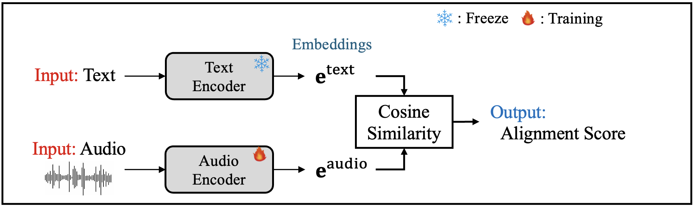
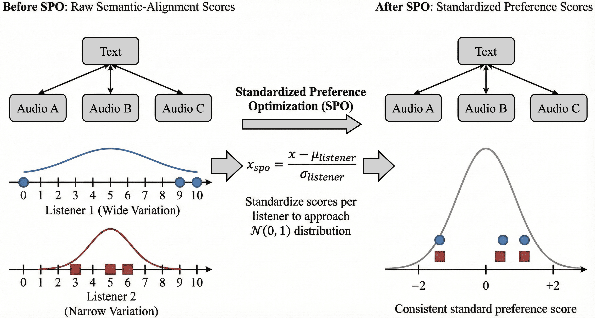

# SPO-CLAPScore
This repository contains the implementation for the "Takano\_UTokyo\_03" system submitted to the first XACLE Challenge.
<!-- <div align="center">
  
  <br>
  <em>Fig. Overview architecture of SPO-CLAPScore</em>
</div> -->

<div align="center">
  
  <br>
  <em>Fig. Standard Preference Optimization (SPO)</em>
</div>

## Abstract

The first XACLE Challenge (x-to-audio alignment challenge) addresses the critical need for automatic evaluation metrics that correlate with human perception of audio–text semantic alignment.

In this paper, we describe the **"Takano_UTokyo_03"** system submitted to XACLE Challenge. Our approach leverages a CLAPScore-based architecture integrated with a novel training method called **Standardized Preference Optimization (SPO)**. SPO standardizes the raw alignment scores provided by each listener, enabling the model to learn relative preferences and mitigate the impact of individual scoring biases. Additionally, we employ listener screening to exclude annotators with inconsistent ratings.

Experimental evaluations demonstrate that both SPO and listener screening effectively improve the correlation with human judgment. Our system achieved 6th place in the challenge with a Spearman's rank correlation coefficient (SRCC) of **0.6142**, demonstrating competitive performance within a marginal gap from the top-ranked systems.

## Install
- Requirements
  - Python: 3.12.8
  - CUDA: 12.6

1. Create env
```bash
python -m venv .venv
source .venv/bin/activate
```

2. Install package
```bash
pip install torch==2.6.0 torchvision==0.21.0 torchaudio==2.6.0 --index-url https://download.pytorch.org/whl/cu126
pip install -r requirements.txt
```

3. Download pretrained weight and the model from M2D
  - This work is based on the pretrained weight from [M2D](https://github.com/nttcslab/m2d). Please download the following files from the official git and place it to the specified directory.
    - Pretrained weight: "M2D-CLAP_2025, fine-tuned on AS2M in Stage 1.1"
      - → `pretrained_models/`
    - Model file: [portable_m2d.py](https://github.com/nttcslab/m2d/blob/master/examples/portable_m2d.py)
      - → `models/`

## Dataset
Please download XACLE dataset from the [official website](https://xacle.org/description.html) and place it inside `datasets/` directory.

## Directory Structure
```
SPO-CLAPScore/
├── README.md
├── LICENSE
├── requirements.txt
├── config.json
├── data_preprocess.py
├── evaluate.py
├── inference_submit.py
├── train_spo.py
├── datasets/
│   ├── xacle_baseline_dataset.py
│   └── XACLE_dataset/              # Need to Download
├── losses/loss_function.py
├── models/
│   ├── portable_m2d.py             # Need to Download
│   └── xacle_model_human_m2d_clap.py
├── pics/
├── pretrained_models/
│   └── m2d_clap_vit_base-80x1001p16x16p16kpBpTI-2025
│           /checkpoint-30.pth      # Need to Download
└── utils/utils.py
```

## Train models
1. Initialize `config.json`
2. Data preprocessing (Listener Screening & Standardize Preference Optimization)
  - --screening_threshold: Threshold τ of listener screening
  - Generates `cfg/config_*.json` and dataset csv
```bash
python data_preprocess.py \
  datasets/XACLE_dataset/meta_data/ \
  --screening_threshold 5 \
  --config config.json
```

3. Train model
```bash
python train_spo.py --config cfg/config_*.json 
```


## Example codes used for XACLE submission
> **Note:** The final submission utilizes an ensemble of outputs from models trained in different conditions. Please refer to our paper for the detail.

- Inference
```bash
python inference_submit.py chkpt_dir_name [validation|test|original-validation]
```
- Evaluation
```bash
python evaluate.py \
    chkpt/20251231_181027_humanm2dclap_lr0.0001_seed3/inference_result_for_original-validation.csv \
    datasets/XACLE_dataset/meta_data/validation_average.csv \
    ./submit_models
```

## Citation
```
@misc{takano2026spoclapscoreenhancingclapbasedalignment,
      title={SPO-CLAPScore: Enhancing CLAP-based alignment prediction system with Standardize Preference Optimization, for the first XACLE Challenge}, 
      author={Taisei Takano and Ryoya Yoshida},
      year={2026},
      eprint={2601.02900},
      archivePrefix={arXiv},
      primaryClass={cs.SD},
      url={https://arxiv.org/abs/2601.02900}, 
}
```

## Acknowledgement

Our code is based on the implementation of [the_first_XACLE_challenge_baseline_model](https://github.com/XACLE-Challenge/the_first_XACLE_challenge_baseline_model) and [M2D](https://github.com/nttcslab/m2d). 

We would like to thank the authors for their excellent works!